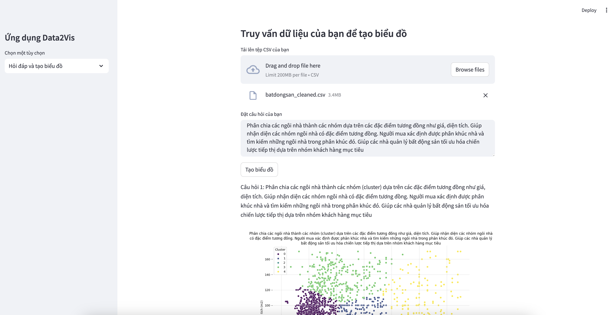
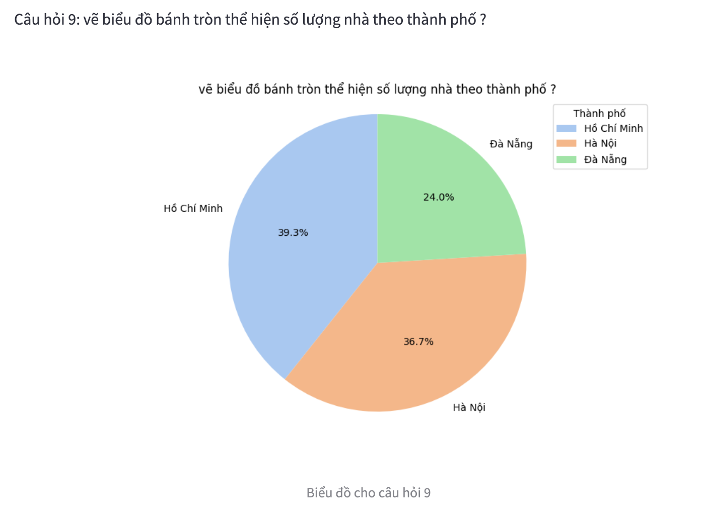
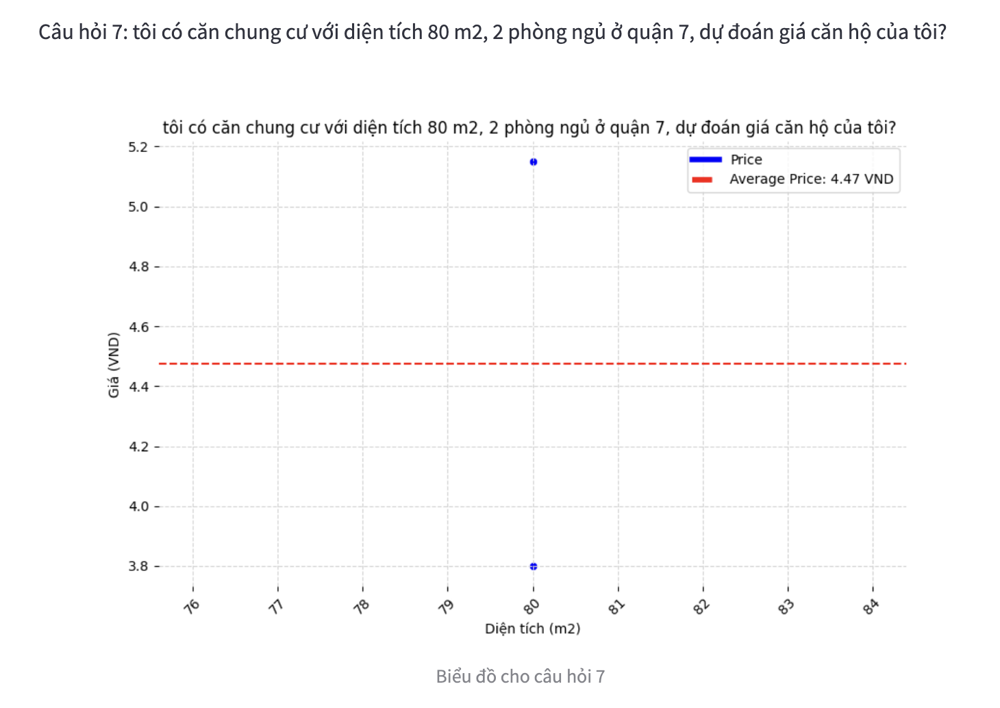
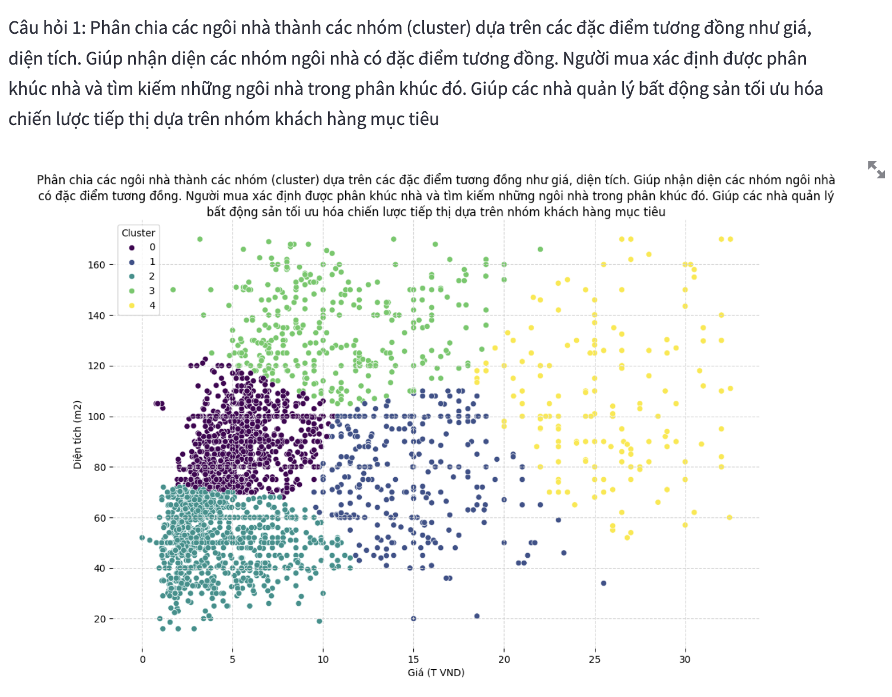
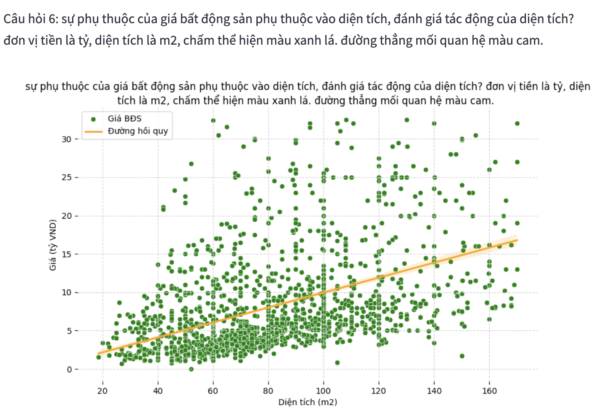

<!-- # Data-Analytic-Auto-App-Using-LLMs -->
### Data2Vis: Tự Động Hóa Việc Tạo Biểu Đồ và Đồ Họa Thông Tin Bằng Mô Hình Ngôn Ngữ Lớn

1. Thêm openapi key vào file env

2. install lib 

`pip install -r requirements.txt`

3. run app
`streamlit run app.py`

Một số hình ảnh minh hoạ từ ứng dụng trên 

